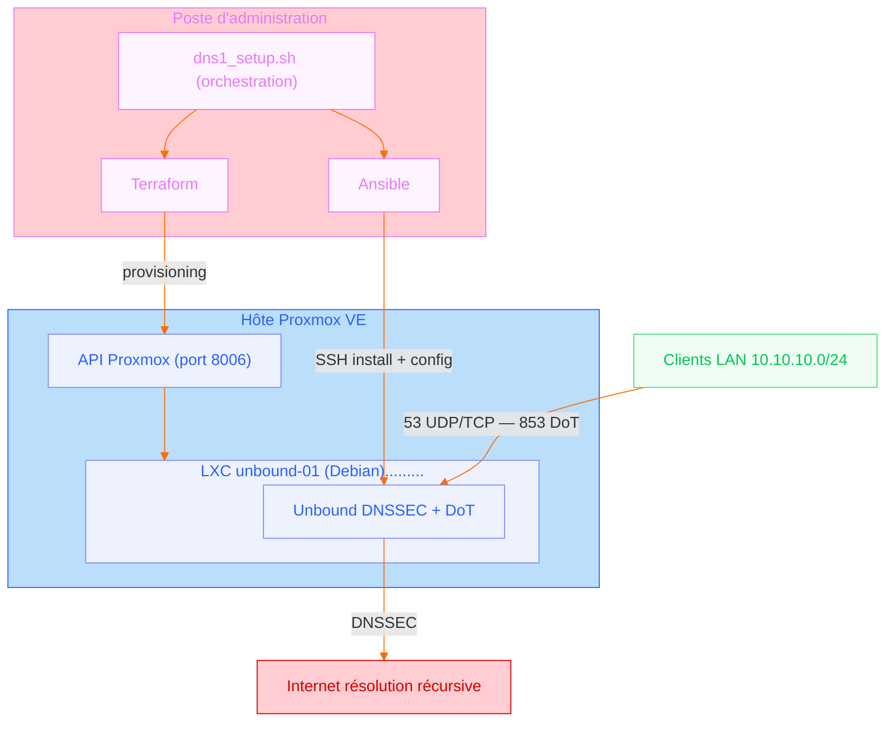

# proxmox-unbound-iac

Provisionnement et configuration reproductibles d'un résolveur DNS Unbound en LXC Proxmox.

Ce dépôt présente une brique d'infrastructure simple, volontairement limitée et testable : créer un conteneur LXC dédié avec Terraform, installer et configurer Unbound avec Ansible, puis valider automatiquement la résolution DNS classique, DNSSEC et DNS-over-TLS.

Le contenu est anonymisé. Les noms de domaine, adresses IP, identifiants Proxmox, certificats TLS et enregistrements DNS internes sont fournis sous forme d'exemples.

---

## Objectif

Dans l'architecture d'origine, Unbound était hébergé dans une VM mutualisée avec d'autres services réseau. Cette brique extrait le service DNS vers un LXC dédié afin de préparer une architecture plus claire :

- séparation des responsabilités ;
- provisioning reproductible ;
- configuration versionnée ;
- tests de non-régression ;
- préparation à un futur second résolveur DNS.

Le périmètre est volontairement restreint : ce dépôt ne couvre pas le firewall, les VLAN, le DHCP ni une HA complète. Il documente uniquement la création et la validation d'un résolveur DNS interne.

---

## Chaîne utilisée

```text
Terraform  -> crée le LXC Proxmox
Ansible    -> installe et configure Unbound
Bash       -> reconstruit et teste le service de bout en bout
```
---

## Schéma



---

## Arborescence

```text
proxmox-unbound-iac/
├── README.md
├── .gitignore
├── terraform/
│   └── proxmox/
│       ├── main.tf
│       ├── variables.tf
│       └── terraform.tfvars.example
├── ansible/
│   ├── inventory/
│   │   └── prod.yml.example
│   ├── group_vars/
│   │   └── unbound.yml
│   ├── site.yml
│   └── roles/
│       └── unbound/
│           ├── tasks/main.yml
│           ├── handlers/main.yml
│           ├── templates/unbound.conf.j2
│           └── files/certs/.gitkeep
├── scripts/
│   └── dns1_setup.sh
└── docs/
    ├── sample_run.log
    └── validation.md
```

---

## Prérequis

Poste d'administration :

- Terraform ;
- Ansible ;
- client SSH ;
- `dig` ;
- `kdig` ;
- `openssl`.

Côté Proxmox :

- un template LXC Debian disponible ;
- un stockage compatible LXC ;
- un bridge réseau LAN ;
- un token API Proxmox disposant des droits nécessaires ;
- accès SSH au LXC par clé publique.

---

## Déploiement

Copier l'exemple de variables Terraform :

```bash
cd terraform/proxmox
cp terraform.tfvars.example terraform.tfvars
```

Adapter les valeurs :

```hcl
proxmox_api_url   = "https://proxmox.example.local:8006/api2/json"
proxmox_api_token = "terraform@pam!provider=REDACTED"
proxmox_node      = "proxmox-node"
lxc_vmid          = 150
lxc_ip_cidr       = "10.10.10.53/24"
gateway           = "10.10.10.1"
storage           = "local-zfs"
bridge            = "vmbr0"
```

Créer le LXC :

```bash
terraform init
terraform validate
terraform apply
```

Copier l'inventaire Ansible :

```bash
cd ../../ansible
cp inventory/prod.yml.example inventory/prod.yml
```

Adapter l'adresse du LXC et la clé SSH.

Déployer Unbound :

```bash
ansible -i inventory/prod.yml dns -m ping
ansible-playbook -i inventory/prod.yml site.yml
```

---

## Rebuild complet et validation

Le script `scripts/dns1_setup.sh` permet de reconstruire le LXC et de rejouer toute la chaîne :

```bash
cd proxmox-unbound-iac
chmod +x scripts/dns1_setup.sh
./scripts/dns1_setup.sh --yes
```

Il effectue les opérations suivantes :

1. destruction ciblée de la ressource Terraform ;
2. recréation du LXC ;
3. attente SSH ;
4. vérification Ansible ;
5. installation/configuration Unbound ;
6. tests DNS UDP/53, TCP/53, DNSSEC et DNS-over-TLS.

Le script est volontairement destructif. Il doit être utilisé sur un environnement de lab ou sur un service dont la reconstruction est maîtrisée.

---

Un exemple de sortie complète d'une exécution réussie est disponible dans
[docs/sample_run.log](docs/sample_run.log).

## Tests réalisés

La validation automatique couvre :

- `unbound-checkconf` ;
- état du service systemd ;
- écoute UDP/53 ;
- écoute TCP/53 ;
- écoute TCP/853 ;
- résolution d'un nom local ;
- résolution d'un PTR local ;
- résolution externe ;
- validation DNSSEC positive ;
- validation DNSSEC négative ;
- handshake TLS sur 853 ;
- requête DNS-over-TLS via `kdig`.

Exemple de résultat attendu :

```text
Résultat final : OK - DNS1 est recréé, configuré et fonctionnel sur 53/853.
```

---

## Données non publiées

Ce dépôt ne doit pas contenir :

- `terraform.tfvars` ;
- fichiers `terraform.tfstate` ;
- clés privées TLS ;
- certificats réels ;
- secrets API Proxmox ;
- hostnames internes réels ;
- adresses IP publiques ;
- exports complets de configuration de production.

Les fichiers nécessaires sont remplacés par des exemples.

---

## Limites

Cette brique ne prétend pas couvrir tous les cas de production.

Elle documente une pratique d'exploitation :

- infrastructure décrite par code ;
- configuration rejouable ;
- service critique isolé ;
- tests techniques reproductibles ;
- publication anonymisée.

Le durcissement réseau final reste à adapter selon le contexte : firewall local, filtrage Proxmox, règles OPNsense, segmentation VLAN ou ACL dédiées.

---

_L'anonymisation des exemples et la relecture de mise en forme du code ont été réalisées avec l'assistance de Claude (Anthropic). Le code réel, l'architecture et les choix techniques sont de l'auteur._

