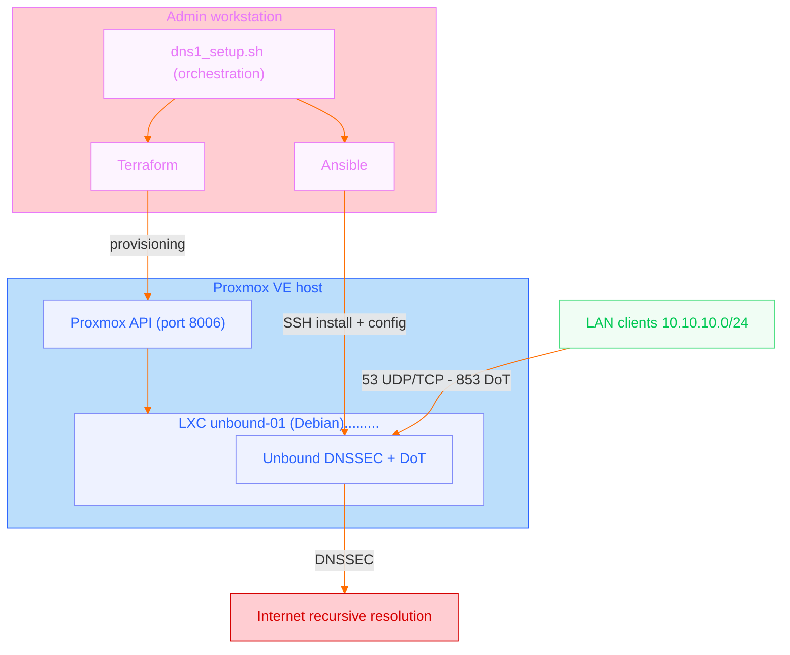

# Unbound DNS resolver in a Proxmox LXC - IaC (Terraform + Ansible) + DNSSEC/DoT validation

Reproducible provisioning and configuration of an Unbound DNS resolver in a Proxmox LXC.

This repository presents a simple infrastructure building block, deliberately limited and testable: create a dedicated LXC container with Terraform, install and configure Unbound with Ansible, then automatically validate standard DNS resolution, DNSSEC and DNS-over-TLS.

The content is anonymized. Domain names, IP addresses, Proxmox credentials, TLS certificates and internal DNS records are provided as examples.

---

## Project background

This repository is an anonymized and simplified version of a building block actually tested in a Proxmox lab environment. It does not reuse production values, but keeps the same provisioning, configuration and technical validation logic.

---

## Objective

In the original architecture, Unbound was hosted in a VM shared with other network services. This building block extracts the DNS service into a dedicated LXC in order to prepare a cleaner architecture:

- separation of concerns ;
- reproducible provisioning ;
- version-controlled configuration ;
- regression tests ;
- groundwork for a future second DNS resolver.

The scope is deliberately limited: this repository does not cover the firewall, the VLANs, DHCP or full HA. It documents only the creation and validation of an internal DNS resolver.

---

## Toolchain

```text
Terraform  -> creates the Proxmox LXC
Ansible    -> installs and configures Unbound
Bash       -> rebuilds and tests the service end to end
```
---

## Skills demonstrated

- Infrastructure as Code with Terraform on Proxmox VE
- configuration automation with Ansible
- Linux & systemd operations
- configuration of a recursive Unbound resolver
- DNSSEC, DNS-over-TLS, root hints, trust anchor
- automated technical validation through a Bash script
- anonymization of a real case for portfolio publication
---

## Diagram



---

## Directory layout

```text
proxmox-unbound-iac/
├── README.md
├── .gitignore
├── terraform/
│   └── proxmox/
│       ├── main.tf
│       ├── variables.tf
│       └── terraform.tfvars.example
├── ansible/
│   ├── inventory/
│   │   └── prod.yml.example
│   ├── group_vars/
│   │   └── unbound.yml
│   ├── site.yml
│   └── roles/
│       └── unbound/
│           ├── tasks/main.yml
│           ├── handlers/main.yml
│           ├── templates/unbound.conf.j2
│           └── files/
│               └── certs/
│                   └── README.md
├── scripts/
│   └── dns1_setup.sh
└── docs/
    ├── sample_run.log
    └── validation.md
```

---

## Prerequisites

Administration host:

- Terraform ;
- Ansible ;
- SSH client ;
- `dig` ;
- `kdig` ;
- `openssl`.

On the Proxmox side:

- an available Debian LXC template ;
- an LXC-compatible storage ;
- a LAN network bridge ;
- a Proxmox API token with the required rights ;
- SSH access to the LXC via public key.

---

## Deployment

Copy the Terraform variables example:

```bash
cd terraform/proxmox
cp terraform.tfvars.example terraform.tfvars
```

Adjust the values:

```hcl
proxmox_api_url   = "https://proxmox.example.local:8006/api2/json"
proxmox_api_token = "terraform@pam!provider=REDACTED"
proxmox_node      = "proxmox-node"
lxc_vmid          = 150
lxc_ip_cidr       = "10.10.10.53/24"
gateway           = "10.10.10.1"
storage           = "local-zfs"
bridge            = "vmbr0"
```

Create the LXC:

```bash
terraform init
terraform validate
terraform apply
```

Copy the Ansible inventory:

```bash
cd ../../ansible
cp inventory/prod.yml.example inventory/prod.yml
```

Adjust the LXC address and the SSH key.

Deploy Unbound:

```bash
ansible -i inventory/prod.yml dns -m ping
ansible-playbook -i inventory/prod.yml site.yml
```

---

## Full rebuild and validation

The `scripts/dns1_setup.sh` script rebuilds the LXC and replays the entire chain:

```bash
cd proxmox-unbound-iac
chmod +x scripts/dns1_setup.sh
./scripts/dns1_setup.sh --yes
```

It performs the following operations:

1. targeted destruction of the Terraform resource ;
2. recreation of the LXC ;
3. waiting for SSH ;
4. Ansible check ;
5. Unbound install and configuration ;
6. DNS tests UDP/53, TCP/53, DNSSEC and DNS-over-TLS.

The script is intentionally destructive. It must be used on a lab environment or on a service whose rebuild is fully under control.

---
## Anonymized execution log


An anonymized execution log, taken from a real environment, is available in
[docs/sample_run.log](docs/sample_run.log).


This file serves as a technical illustration: it shows the full flow of a validated rebuild
Terraform -> Ansible -> DNS/DNSSEC/DoT tests and is taken from a real environment. It therefore
does not faithfully represent the output of the public script presented here: the inventory values, hostnames, IP addresses,
certificates, keys and some labels have been anonymized or adapted for this publication.

---

## Tests performed

The automated validation covers:

- `unbound-checkconf` ;
- systemd service status ;
- UDP/53 listener ;
- TCP/53 listener ;
- TCP/853 listener ;
- local name resolution ;
- local PTR resolution ;
- external resolution ;
- positive DNSSEC validation ;
- negative DNSSEC validation ;
- TLS handshake on 853 ;
- DNS-over-TLS query via `kdig`.

Example of expected output:

```text
Final result: OK - DNS1 recreated, configured and operational on 53/853.
```

---

## Data not published

This repository must not contain:

- `terraform.tfvars` ;
- `terraform.tfstate` files ;
- TLS private keys ;
- real certificates ;
- Proxmox API secrets ;
- real internal hostnames ;
- public IP addresses ;
- full production configuration exports.

The required files are replaced with examples.

---

## Limitations

This building block does not claim to cover every production case.

It documents an operational practice:

- infrastructure described as code ;
- replayable configuration ;
- critical service isolated ;
- reproducible technical tests ;
- anonymized publication.

`transparent` is used (`local-zone:` in [ansible/roles/unbound/templates/unbound.conf.j2](ansible/roles/unbound/templates/unbound.conf.j2)) to define only a few local records while keeping recursive resolution for all other names. This is a personal choice that should be adapted to your needs.

Final network hardening still has to be adapted to the context: local firewall, Proxmox filtering, OPNsense rules, VLAN segmentation or dedicated ACLs.

---

_The anonymization of the data shown here, together with the formatting of the code and text for publication, was carried out with the assistance of Claude (Anthropic). Everything was reviewed and validated by the author before publication. The actual code, architecture and technical choices are the author's own._
